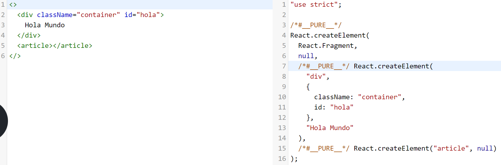

# JSX

Es una extensión de la sintaxis de JavaScript que produce elementos de React.

Se puede usar:
* Dentro de estructuras de control como if y for.
* Asignarlo a variables.
* Aceptarlo como argumento o retorno en funciones.
* Expresiones JavaScript.

Veamos un ejemplo tomado del código que genera create-react-app:

```javascript
<div className="App">
    <header className="App-header">
        
        <p>
            Edit <code>src/App.js</code> and save to reload.
        </p>
        <a
            className="App-link"
            href="https://reactjs.org"
            target="_blank"
            rel="noopener noreferrer"
        >
            Learn React
        </a>
    </header>
</div>
```

JSX es similar a HTML pero con algunas diferencias importantes:

Algunas reglas importantes:
* Toda etiqueta debe cerrarse por ejemplo `<br>` debera cerrarse a `<br/>`.
* Los componentes deben devolver un sólo elemento padre.
* Algunos atributos HTML cambian como:
  * **class** por **className**
  * **for** por **htmlFor**
* Los atributos de un elemento JSX pueden aceptar valores de tipo String entrecomillados o expresiones JavaScript entre llaves, por ejemplo:
  * ``

## JSX se transforma en JavaScript

Por debajo **JSX** se transforma en código JavaScript. Por ejemplo, el siguiente código JSX.

```javascript
<div class="active">Hola Mundo</div>
```

se transforma en el siguiente código JavaScript

```javascript
React.createElement("div", {className: "active"}, "Hola mundo");
```

Puedes utilizar el REPL de Babel (https://babeljs.io/repl) para ver en qué se convierte el código JSX que escribes.



La ventaja de **JSX** es que, como es JavaScript, podemos:

1. Ver algunos errores en tiempo de compilación.
2. Asignar JSX a variables. Por ejemplo:
  ```javascript
  const el = <p>Hola</p>
  ```
3. Retornar **JSX** desde métodos. Por ejemplo:
  ```javascript
  renderText() {
      if (someCondition) {
          return <p>Hola</p>
      } else {
          return <p>Mundo</p>
      }
  }
  ```

Una restricción de JSX es que siempre debes tener un elemento raíz:
```javascript
const el = (
    <div>
        <p>Hola</p>
        <p>Mundo</p>
    </div>
)
```
Este es un patrón muy común en las aplicaciones de React.

## Mezclando JSX con JavaScript

Para mezclar código JavaScript en JSX utiliza corchetes (`{}`):

```javascript
const style = "active";
const title = "Hola Mundo";

<div className={style}>{title}</div>;
```

Una restricción de **JSX** es que no puedes utilizar **if**, **else**, **while** o **for**

Para agregar condicionales utiliza el **operador ternario**

```javascript
<div>
{
    condition
    ? <h1>Hola Mundo</h1>
    : null
}
</div>

<p>{auth?"El usuario esta logueado":"El usuario No esta logueado"}</p>
```
Para mostrar elementos de un arreglo o un objeto utiliza map:

```javascript
const names = ["Jon", "Irma", "kEnAi"];

const jsx = (
  <ul>
    {
    names.map((name, index) => (
        <li key={index}>{name}</li>
    ))
    }
  </ul>
);
```

## Estilos CSS inline en JSX

Es posible definir y utilizar estilos inline en **JSX**:

```javascript
let styles = {
  borderColor: "#999",
};

const jsx = <div style={styles}>Hola mundo</div>;
```

## Eventos del DOM en JSX

En **JSX** se utilizan los eventos estándar del DOM como **onclick**, **onchange**, **onkeydown**, ... pero utilizando camelCase: **onClick**, **onChange**, **onKeyDown**, ...

```javascript
<button onClick={alert("Hola")}>Hola</button>
```
Fíjate que utilizamos corchetes (`{}`) para escribir nuestro código JavaScript.

También podríamos pasar una función que es invocada cuando se genere el evento:

```javascript
const saludar = () => alert("Hola!");
<button onClick={saludar}>Saluda</button>
```
Fíjate que no estamos invocando la función **saludar**, sólo la estamos pasando para que React la invoque cuando ocurra el evento.

